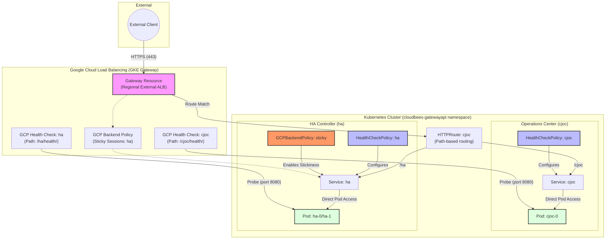

# GKE Gateway API Architecture & Traffic Flow

This diagram illustrates how external traffic reaches the CloudBees CI Operations Center (`cjoc`) and Managed Controllers (e.g., `ha`), along with the health check and session affinity configurations.

## Component Breakdown

1. External Client: Initiates requests to `https://gateway.acaternberg.flow-training.beescloud.com/`.
2. GKE Gateway: Provisions a Regional External Application Load Balancer. It handles TLS termination and backend service association.
3. HTTPRoute: Defines path-based routing for both the Operations Center (`/cjoc`) and Managed Controllers (`/ha`).
4. HealthCheckPolicy: Overrides default GCP health checks.
    - cjoc: Probes `/cjoc/health/` on port 8080.
    - ha: Probes `/ha/health/` on port 8080.
5. GCPBackendPolicy (Sticky Sessions): Configured for the `ha` controller to enable **Generated Cookie** session affinity with a 1-hour TTL and 60-second connection draining. This is critical for High Availability (HA) controllers where users must remain on the same pod during a session.
6. Services (cjoc, ha): Standard Kubernetes Services configured with Network Endpoint Groups (NEGs) for direct L7-to-Pod load balancing.
7. Pods: The actual application containers. Managed Controllers use NEGs to ensure the Load Balancer can route directly to the correct instance.
