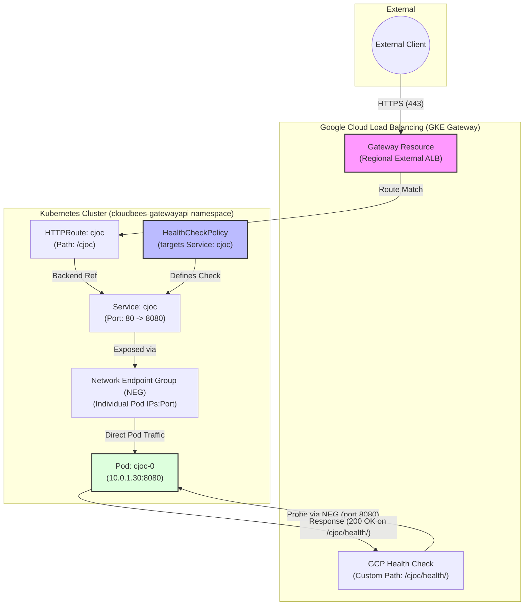

# GKE Gateway API Architecture & Traffic Flow

This diagram illustrates how external traffic reaches the CloudBees CI Operations Center (`cjoc`) and how the health check configuration ensures high availability.

## Component Breakdown

1.  **External Client**: Initiates requests to `https://gateway.acaternberg.flow-training.beescloud.com/cjoc`.
2.  **GKE Gateway**: Provisions a Regional External Application Load Balancer. It terminates TLS using a self-signed secret.
3.  **HTTPRoute**: A Gateway API resource that defines how traffic matching `/cjoc` should be routed to the `cjoc` Service.
4.  **HealthCheckPolicy**: A GKE-specific resource that overrides the default Load Balancer health check. It ensures the LB probes `/cjoc/health/` instead of the default `/`.
5.  **Service (cjoc)**: A standard Kubernetes Service that defines the logical grouping of pods. It is annotated (via NEG) for direct LB-to-pod communication.
6.  **Network Endpoint Group (NEG)**: Automatically managed by GKE. It allows the Load Balancer to bypass the `kube-proxy` (iptables) and send traffic directly to the pod IPs, reducing latency and improving distribution.
7.  **Pod (cjoc-0)**: The actual CloudBees CI Operations Center container, running on port 8080.
