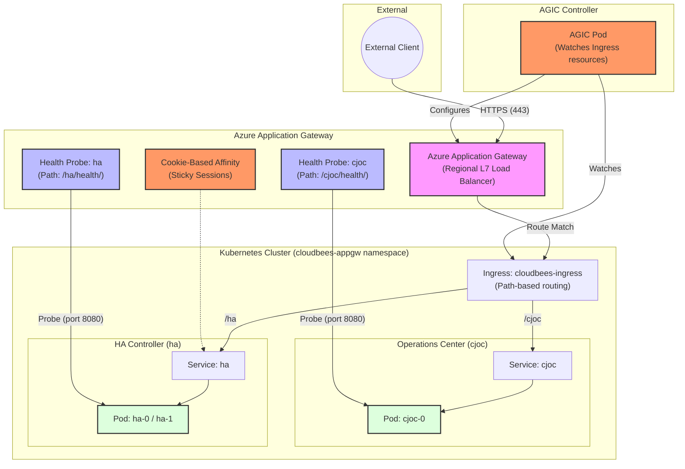

# Azure Application Gateway Architecture & Traffic Flow

This diagram illustrates how external traffic reaches the CloudBees CI Operations Center (`cjoc`) and Managed Controllers (e.g., `ha`) when using **Azure Application Gateway Ingress Controller (AGIC)**.

## Component Breakdown

1. **External Client**: Initiates HTTPS requests to `https://gateway-appgw.acaternberg.flow-training.beescloud.com/`.
2. **Azure Application Gateway**: A regional Layer 7 load balancer that handles TLS termination, path-based routing, and health probing. Provisioned in Azure as a managed service.
3. **AGIC (Application Gateway Ingress Controller)**: A Kubernetes controller that watches Ingress resources and automatically configures the Azure Application Gateway based on annotations and rules.
4. **Ingress**: Standard Kubernetes Ingress resource with Azure-specific annotations defining:
   - Path-based routing for `/cjoc` and `/ha`
   - Custom health probe paths
   - Cookie-based session affinity
   - SSL settings
5. **Health Probes**: Azure Application Gateway health probes configured via annotations:
   - **cjoc**: Probes `/cjoc/health/` on port 8080
   - **ha**: Probes `/ha/health/` on port 8080
6. **Session Affinity**: Cookie-based sticky sessions enabled for the `ha` controller to ensure users remain on the same pod during their session. Critical for High Availability (HA) controllers.
7. **Services (cjoc, ha)**: Standard Kubernetes ClusterIP Services that expose the CloudBees CI pods.
8. **Pods**: The actual CloudBees CI application containers.

## Key Differences vs. Envoy Gateway

| Concern | Envoy Gateway | Azure Application Gateway |
| :--- | :--- | :--- |
| Controller | Envoy Gateway Controller | Azure AGIC |
| Load balancer | AKS Service LoadBalancer (Envoy pods) | Azure Application Gateway (managed service) |
| Health checks | `BackendTrafficPolicy` (CRD) | Azure health probe annotations |
| Sticky sessions | `BackendTrafficPolicy` (CRD) | Cookie-based affinity annotation |
| Configuration | Gateway API resources (Gateway, HTTPRoute) | Ingress resources with annotations |
| Azure integration | None | Native Azure networking (WAF, NSG, etc.) |
| TLS | Kubernetes secret | Kubernetes secret or Azure Key Vault |
