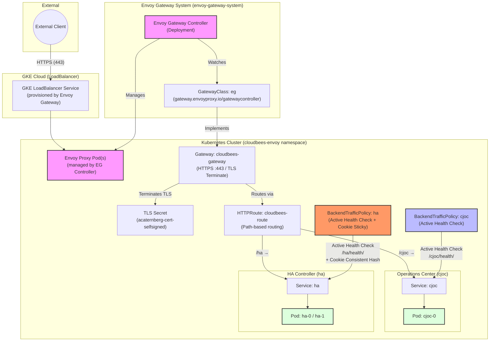

# Envoy Gateway Architecture & Traffic Flow

This diagram illustrates how external traffic reaches the CloudBees CI Operations Center (`cjoc`) and Managed Controllers (e.g., `ha`) when using **Envoy Gateway** as the ingress controller.

## Component Breakdown

1. **External Client**: Initiates HTTPS requests to `https://gateway.acaternberg.flow-training.beescloud.com/`.
2. **GKE LoadBalancer**: A `Service` of type `LoadBalancer` automatically provisioned by Envoy Gateway. Exposes the Envoy proxy pods externally.
3. **GatewayClass (`eg`)**: Links the Gateway resource to the Envoy Gateway controller (`gateway.envoyproxy.io/gatewaycontroller`). Equivalent to the GKE `gke-l7-regional-external-managed` GatewayClass.
4. **Gateway (`cloudbees-gateway`)**: Defines the HTTPS listener on port 443 with TLS termination using the Kubernetes TLS secret.
5. **HTTPRoute (`cloudbees-route`)**: Path-based routing:
   - `/cjoc/*` → `cjoc` Service
   - `/ha/*` → `ha` Service
6. **BackendTrafficPolicy (cjoc)**: Configures active HTTP health checks probing `/cjoc/health/` on the `cjoc` Service. Equivalent to the GKE `HealthCheckPolicy`.
7. **BackendTrafficPolicy (ha)**: Configures active HTTP health checks on `/ha/health/` **and** cookie-based consistent-hash load balancing (sticky sessions) via `CBCI_SESSION`. This is the combined equivalent of GKE's `HealthCheckPolicy` + `GCPBackendPolicy`.
8. **Envoy Proxy Pods**: The data-plane sidecar pods managed by Envoy Gateway. All routing, health checking, and session-affinity logic is enforced here — no GCP-specific proxy subnet required.

## Key Differences vs. GKE Gateway API

| Concern | GKE Gateway API | Envoy Gateway |
| :--- | :--- | :--- |
| GatewayClass | `gke-l7-regional-external-managed` | `eg` |
| Load balancer | GCP Regional External ALB | GKE Service `type: LoadBalancer` (Envoy pods) |
| Health checks | `HealthCheckPolicy` (networking.gke.io) | `BackendTrafficPolicy` (active health check) |
| Sticky sessions | `GCPBackendPolicy` (GENERATED_COOKIE) | `BackendTrafficPolicy` (ConsistentHash/Cookie) |
| Proxy subnet | GCP proxy-only subnet required | Not needed |
| TLS | Kubernetes TLS secret | Kubernetes TLS secret (same) |
